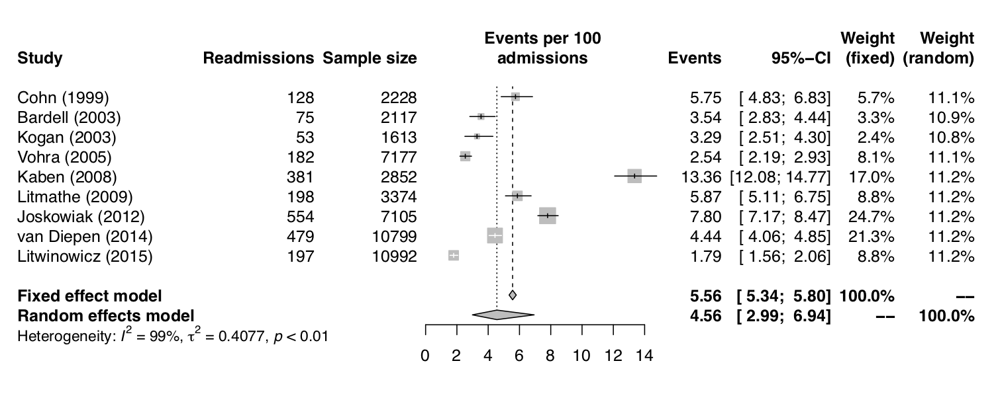

---
# LUE TARKEMMAT OHJEET github.com/brentthorne/posterdown
#
# Tämä posteripohja on tarkoitettu käytettäväksi R / RStudio ympäristössä.
#
# Jos et halua jotain omianisuutta käyttöön, voit poistaa sen kommentoimalla kyseisen rivin lisäämällä rivin alkuun # -merkin
#
# Posterin koko (leveys x korkeus tuumina)
# A0: 33.1 x 46.8
# A1: 23.4 x 33.1
# A2: 16.5 x 23.4
# A3: 11.7 x 16.5
#
# HUOMAA: Jos muutat posterin tyylin pysty suunnasta vaakasuuntaan pitää sinun vaihtaa tässä myös korkeus ja leveys päikseen
#
poster_height: "46.8in"
poster_width: "33.1in"
#
##
# KESKEISET TIEDOT
#
# Posterin / abstraktin otsikko kirjoitetaan tähän
title: '**Posterin / abstraktin otsikko kirjoitetaan tähän. Jos se on kovin pitkä, jakautuu se kahdelle riville.**'
#
# Keskeisin löydös esitetään posterissa ylimpänä
main_findings: "Tähän kirjoitetaan posterin **keskeisin löydös**. Käytä lihavointia merkitsemään **tärkeät** sanat."
#
# Kirjoittajat
# Ensisijaiset kirjoittajat merkitään 'main: true' merkinnällä.
author:
  - name: Juuso N. Tamminen
    affil: 1, 2
    main: true
    twitter: juksu
    email: juuso.tamminen@kuh.fi
    orcid: 0000-0002-1680-3161
  - name: Ylilääkäri Ylermi
    affil: 1
  - name: Pertti Professori
    affil: 1
  - name: Tauno Dosentti
    affil: 1, 3
affiliation:
  - num: 1
    address: School of Medicine, University of Eastern Finland
  - num: 2
    address: Department of Anesthesiology and Intensive Care, Kuopio University Hospital
  - num: 3
    address: Department of Cardiology, Kuopio University Hospital
#
# TYYLI JA MUOTOILU
#
##
# PALSTAT (2 tai 3 palstaa)
##
#
column_numbers: 2
#
## KYSin brändivärit
#
# Punainen (Pantone 192C) HEX: #FF4046
# Musta (Pantone Process Black) HEX: #3E3E3E
# Keltainen (Pantone 114C) HEX: #FEE840
# Sininen (Pantone 2925C) HEX: #3FA9F5
#
# Kopioi näistä haluamasi pääväri kohtiin 'primary_colour' ja 'secondary_colour'. Jos käytät näissä eri väriä,
# tekee templaatti automaattisesti liukuvärjäyksen näiden välille.
# 
# Tämän esimerkin väri on sininen
#
##
#
primary_colour: '#3FA9F5'
secondary_colour: '#3FA9F5'
accent_colour: '#FF4046'
body_bgcol: "#FFFFFF"
body_textcol: "#3E3E3E"
middle_textcol: "#FFFFFF"
#
## KYSin brändifontit
#
# Brändifontit on saatavilla Google Fonts -kirjastosta.
#
# Otsikot: Montserrat
# Leipäteksti: Open Sans Regular
##
#
font_family: 'Montserrat'
main_fontfamily: "Open Sans"
middle_fontfamily: "Montserrat"
#
##
# Tekstin koko
#
# Tekstin koko kannattaa merkitä pikseleinä (px).
# 
##
#
title_textsize: "80px"
author_textsize: "1em"
authorextra_textsize: "0.8em"
affiliation_textsize: "0.5em"
affiliation_textcol: '#3E3E3E'
caption_fontsize: "0.5em"
sectitle_textsize: "40px"
reference_textsize: "30px"
body_textsize: "40px"
#
#
## LOGOT
# 
# Posterin alareunaan voi käyttää kolmea eri logoa. Paketissa on mukana eri väriversiot KYS:n logosta ja musta versio UEF:in logosta.
# Käytä vain niitä logoja, joiden affiliaatio posterissa on.
# 
# Keskellä voi käyttää QR-koodia. QR koodin pitäisi johtaa posterin / abstraktin / artikkelin verkossa olevaan versioon,
# jossa voi myös olla lisämateriaalia.
#
# HUOMAA! Logojen KOKO määritellään dokumentin lopussa olevilla <style> määritteillä!
# 
##
#
logoleft_name: "Figures/KYS_mus_en_web_png.png"
logoright_name: "Figures/UEF_eng_vaaka_1_black.png"
#logocenter_name: "Figures/qr-code.png"
# QR-koodi on nyt pois käytöstä
#
#--Standard Options--#
output: 
  posterdown::posterdown_betterport:
    self_contained: false
    pandoc_args: --mathjax
    highlight: espresso
    number_sections: false
bibliography: MyBib.bib

---

```{r setup, include=FALSE}
knitr::opts_chunk$set(
  results = 'asis',
  echo = FALSE,
  warning = FALSE,
  message = FALSE,
  fig.align = 'center',
  options(knitr.kable.NA = '')
)
library(readxl)
library(magrittr)
library(knitr)
library(kableExtra)
library(formattable)
```

<!-- Sisältö alkaa tästä. -->

# Johdanto

Aikaisempi tutkimustieto osoittaa, että **`tämä tosi tärkeä juttu`** saattaa **`lisätä`** kiinnostusta tutkimuksen tekemiseen. Saataa myös olla että näin ei ole.

Koska emme voi olla varmoja, päätimme tehdä tämän tutkimuksen. Tässä on yksi tosi tärkeä viite aiheeseen [@turnerControlsWaterBalance2014]. 

# Menetelmät

- Haastattelimme vuosina 2008-2015 Itä-Suomen yliopistosta valmistuneita lääketieteen opiskelijoita (**`N=1312`**). 

- Kyselimme heiltä kaikenlaisia erikoisia kysymyksia erilaisiin aiheisiin liittyen. Useimmat heistä vastasivat todella mielellään tähän tärkeään tutkimukseemme.

# Tulokset

Tässä on esitetty taulukko, jossa on viisi saraketta ja useita rivejä. Se sisältää tärkeää ja keskeistä tietoa, joka tukee tutkimuksen johtopäätelmiä.

```{r, out.width='110%', fig.align='center'}
table1 <- read_excel("Data/table_1.xlsx")
colnames(table1)[1:2] <- ""
table1 %>% 
  kable(align = 'l') %>%
  kable_styling(font_size = 65) %>% 
  row_spec(0, background = "#CCCCCC") %>%
  column_spec(1, bold = T) %>%
  column_spec(2, width = "30%") %>%
  column_spec(3, width = "20%") %>% 
  column_spec(4, width = "20%") %>% 
  column_spec(5, width = "5%") %>% 
  collapse_rows(columns = 1, valign = "top")
```

- **`Merkittävät nostot`** löydöksistä on syytä esittää tässä omina bullet-pointteina.

- On hyvä korostaa, että **`eroja ei havaittu`** ryhmien välillä.

- Tämä voi johtua mm. siitä, että **`tutkimusaineisto oli liiaan pieni`** tämän muutoksen havaitsemiseen.

```{r, echo=FALSE, fig.cap="", out.width = '100%', fig.align="left"}

```

# Johtopäätökset

Tähän kirjoitetaan tutkimuksen keskeinen johtopäätös. On tärkeää **`korostaa assosiaatiota`** asioiden välillä. Tämä ei tietenkään pidä paikkaansa, mutta kirjoittelen tähän mitä sattuu, jotta saisin vähän sisältöä tähän posteriin.

Voi myös olla, että **`kysymyksen asettelu`** oli väärä.

# Sidonnaisuudet

- Juuso Tamminen on saanut palkkaa työnantajaltaan. Tällä palkalla hän rahoittaa harrastuksensa, mm. posteri templaattien puuhastelua.

- Muilla kirjoittajilla on todella paljon sidonnaisuuksia. Ylilääkäri Ylermi on saanut apurahaa (GWS4040112) Tosi Tärkeältä Lääketieteen säätiöltä. Lisäksi hän on toiminut luennoistijana Isolle Lääkeyritykselle.

<!-- Sisältö päättyy tähän. -->

# Kirjallisuus

<!-- Tähän tulee automaattisesti kirjallisuusluettelo käyttämiesi viitteiden perusteella. -->

<!-- Tästä eteenpäin on tarkempia tyyliohjeita. #main-img muuttujilla säädetään alareunan logojen koko (prosenttia leveydestä). -->

<style>
#main-img-left {
 width: 20%;
}
#main-img-center {
 width: 10%;
}
#main-img-right {
 width: 30%;
}
</style>